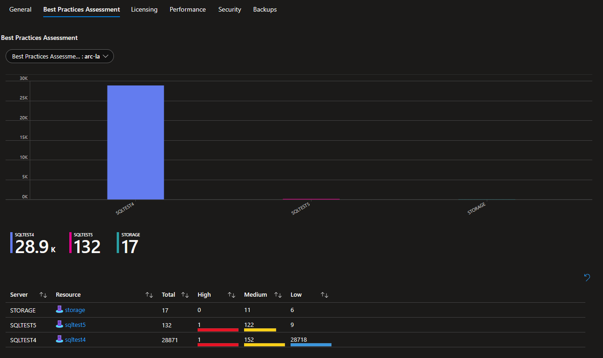
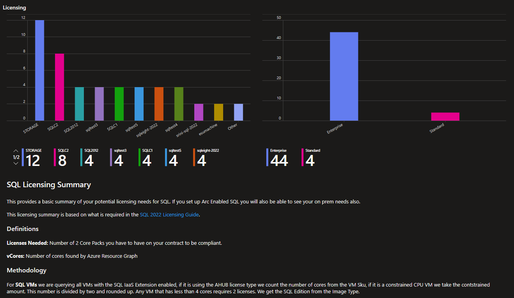
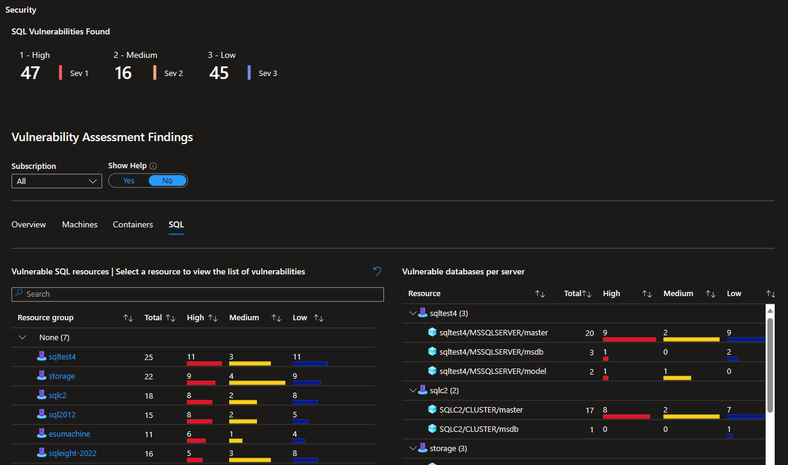
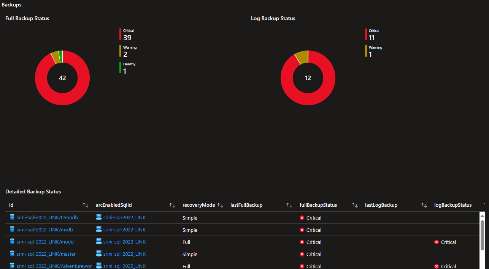
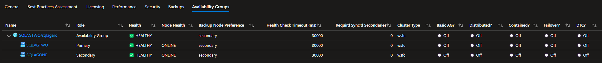

# Arc-enabled-SQL-Dashboards
This repository contains queries and workbooks to build out an Azure Dashboard to view Arc-enabled SQL Servers.

## Deployment
Click the button below to deploy to your Azure Subscription:

### The General Tab shows a single place with all your SQL resources

### The Best Practices Assessment Tab breaks down your bpa findings into a single, filterable location

### The Licensing Tab shows you your licensing needs across Arc enabled and Azure SQL

### The Performance Tab shows SQL Server OS Level performance stats from VM Insights

### The Security Tab gives a rundown of security findings from Defender for SQL

### The Backups Tab gives a full report of your backups on all Arc Enabled SQL Servers and a single area to see your auto backup settings

### The Availability Groups Tab gives a tree based view of the health of all your Always On Availability Groups
